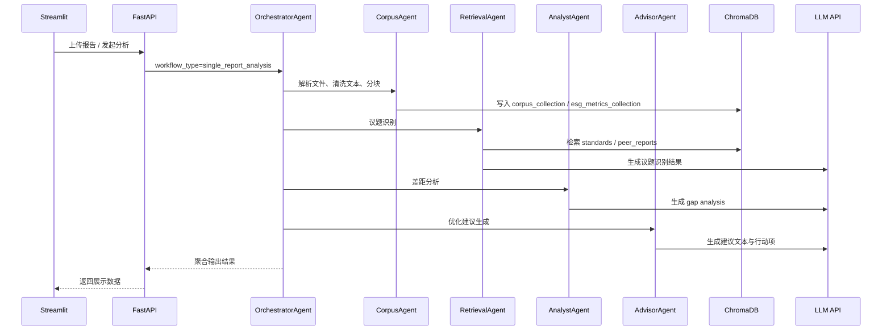

# 远景能源 ESG 披露与沟通智能分析系统

上海财经大学 MBA 整合实践项目  
合作企业：远景能源有限公司（Envision Energy）

课题名称：AI 驱动的新能源行业 ESG 披露与沟通智能分析框架研究

## 项目目标

本项目聚焦新能源行业 ESG 披露场景，提供一套以规则和知识库为基础、以大模型辅助分析为增强的智能分析系统，用于支持：

- 单份 ESG 报告的议题识别
- 对照披露标准的差距分析
- 披露优化建议生成
- 人工复核与审计留痕

注意：本系统 AI 输出仅为辅助参考，不构成任何正式披露建议，所有对外内容必须经过人工复核。

## 当前范围

按当前项目计划，功能分为三个优先级阶段：

| 优先级 | 功能 | 状态 |
|--------|------|------|
| P0 | 单报告分析 `single_report_analysis` | 已实现 |
| P1 | 对话窗口（检索问答） | 待实现 |
| P2 | 行业竞品对标与分析 | 预留接口，未完成 |
| P2 | 披露标准版本差异分析 | 待实现 |

当前代码中真正打通的主流程是 `single_report_analysis`，即：

`CorpusAgent -> RetrievalAgent -> AnalystAgent -> AdvisorAgent`

## 技术栈

- Python：3.13
- 前端：Streamlit
- 后端：FastAPI
- LLM 接入：通过 `LLM_BASE_URL` + `LLM_API_KEY` 配置的 OpenAI 兼容接口
- 向量数据库：ChromaDB
- 嵌入模型：`BAAI/bge-m3`
- 嵌入服务：SiliconFlow API
- 数据存储：ChromaDB + SQLite

## 技术架构

### 分层架构示意

```text
+------------------------------------------------------------------+
| 展示层                                                           |
| Streamlit UI                                                     |
| 报告上传 | 议题识别 | 差距分析 | 人工复核 | 审计日志 | 规则配置  |
+------------------------------------------------------------------+
                               |
                               v
+------------------------------------------------------------------+
| 接口层                                                           |
| FastAPI API                                                      |
| corpus_router | retrieval_router | analyst_router | advisor_router |
+------------------------------------------------------------------+
                               |
                               v
+------------------------------------------------------------------+
| 调度层                                                           |
| OrchestratorAgent                                                |
| 固定流程状态机，负责步骤编排、状态跟踪、异常上报                 |
+------------------------------------------------------------------+
                               |
                               v
+------------------------------------------------------------------+
| 执行层                                                           |
| CorpusAgent -> RetrievalAgent -> AnalystAgent -> AdvisorAgent    |
| 语料处理 -> 议题识别 -> 差距分析 -> 建议生成                     |
+------------------------------------------------------------------+
                |                                  |
                v                                  v
+----------------------------------+   +---------------------------+
| 数据层                           |   | 外部服务层                |
| ChromaDB                         |   | LLM API / SiliconFlow     |
| corpus / metrics / standards /   |   | 推理生成 / 向量嵌入       |
| peer_reports                     |   |                           |
| SQLite                           |   |                           |
| 审计日志 / 复核记录              |   |                           |
+----------------------------------+   +---------------------------+
```

### 分层架构表

| 层级 | 组件 | 职责 | 主要输入 | 主要输出 |
|------|------|------|----------|----------|
| 展示层 | Streamlit UI | 报告上传、结果展示、人工复核入口 | 用户上传文件、分析请求 | 可视化分析结果、复核界面 |
| 接口层 | FastAPI API | 参数校验、路由分发、响应封装 | HTTP 请求 | 标准化 JSON 响应 |
| 调度层 | OrchestratorAgent | 固定流程编排、状态跟踪、异常上报 | `workflow_type`、任务参数 | 聚合后的全流程结果 |
| 执行层 | CorpusAgent | 文件解析、文本清洗、分块、入库 | 原始 ESG 报告 | `corpus_result` |
| 执行层 | RetrievalAgent | RAG 检索、议题识别、标准关联 | `corpus_result` | `retrieval_result` |
| 执行层 | AnalystAgent | 标准对照、差距分析、同行参考 | `retrieval_result` | `analyst_result` |
| 执行层 | AdvisorAgent | 建议生成、优先行动项输出 | `analyst_result` | `advisor_result` |
| 数据层 | ChromaDB | 向量存储与语义检索 | 文本分块、标准条文、同行案例 | 检索结果、指标数据 |
| 数据层 | SQLite | 审计日志、复核记录持久化 | Agent 状态、业务记录 | 可追溯日志与记录 |
| 外部服务层 | LLM API / SiliconFlow | 生成式推理与向量嵌入 | Prompt、文本片段 | 议题识别、分析结论、嵌入向量 |

### Agent 架构（1+4）

```text
OrchestratorAgent（总控调度，固定流程状态机）
├── CorpusAgent      # 语料解析与向量化
├── RetrievalAgent   # RAG 检索 + LLM 议题识别
├── AnalystAgent     # 差距分析
└── AdvisorAgent     # 披露建议生成
```

### 单报告分析链路



### Agent 生命周期

所有 Agent 继承同一套基类和状态机，执行状态统一为：

```text
IDLE -> RUNNING -> SUCCESS
               -> FAILED
```

这套状态会同步到日志与审计记录，便于跟踪任务执行链路、失败节点和人工复核过程。

### 当前页面结构

Streamlit 侧已经提供以下页面：

- 首页概览
- 报告上传
- 议题识别
- 差距分析
- 人工复核
- 对标分析
- 审计日志
- 规则配置

其中“对标分析”页面和相关数据准备可先行开展，但总控工作流中的 `multi_company_benchmark` 目前仍是预留接口。

## 目录说明

```text
src/
├── agent/              # Orchestrator + 4 个执行 Agent
├── api/                # FastAPI 路由
├── config/             # 配置、路径、日志
├── ui/                 # Streamlit 应用与页面
└── utils/              # Chroma、LLM、审计、规则等工具

data/
├── knowledge_base/
│   ├── standards/      # 披露标准知识库
│   ├── topic_taxonomy/ # 议题相关知识
│   └── peer_reports/   # 友商/历史报告语料
├── chroma_db/          # Chroma 持久化目录
└── sqlite_db/          # 审计与复核记录

templates/
└── rule_templates/     # 规则模板（如 topic_rules.json）
```

## 数据层设计

### 存储分层

| 层级 | 载体 | 作用 |
|------|------|------|
| 原始语料层 | `data/raw_corpus/` | 保存原始文本和修复后文本，按日期归档 |
| 向量检索层 | `data/chroma_db/` | 保存分块向量、标准条文、同行案例、结构化指标 |
| 业务记录层 | `data/sqlite_db/` | 保存审计日志、人工复核记录 |
| 外置知识层 | `data/knowledge_base/` | 保存标准库、议题知识、同行报告原始材料 |

### Chroma 集合设计

| 集合名 | 内容 | 主要用途 |
|--------|------|----------|
| `corpus_collection` | 报告文本分块 + 文件级 metadata | 语料检索、来源追踪 |
| `esg_metrics_collection` | 提取后的 ESG 结构化指标 | 指标展示、归一化查询 |
| `standards` | 披露标准条文 | 议题识别、标准对照 |
| `peer_reports` | 友商优秀披露案例 | 差距分析、案例参考 |

### 关键 metadata 约束

为保证跨组复用和对标检索一致性，向量数据 metadata 至少需要包含：

- `company`
- `year`
- `industry`
- `topic`

如果缺失这些字段，现有的同行检索和后续对标分析逻辑会受到影响。

## API 概览

当前后端以 `API_PREFIX=/api/v1` 作为统一前缀，核心接口如下：

| 方法 | 路径 | 说明 |
|------|------|------|
| `POST` | `/api/v1/corpus/process` | 上传并解析 ESG 报告 |
| `GET` | `/api/v1/corpus/list` | 查询历史语料 |
| `GET` | `/api/v1/corpus/detail/{corpus_id}` | 查询单份语料详情 |
| `GET` | `/api/v1/corpus/esg-metrics/{corpus_id}` | 查询结构化 ESG 指标 |
| `POST` | `/api/v1/retrieval/run` | 执行议题识别与知识库检索 |
| `POST` | `/api/v1/analyst/analyze` | 执行差距分析 |
| `POST` | `/api/v1/advisor/recommend` | 生成披露优化建议 |

接口层只负责参数校验、错误码封装和响应模型输出，核心业务逻辑统一收敛在 Agent 层。

## 快速开始

### 1. 创建环境

推荐使用 Conda：

```bash
conda env create -f environment.yml
conda activate envision
```

如果已经有 Python 3.13 环境，也可以直接安装：

```bash
python -m pip install --upgrade pip
python -m pip install -e ".[dev]"
```

### 2. 配置环境变量

复制示例配置：

```bash
cp .env.example .env
```

Windows PowerShell 可使用：

```powershell
Copy-Item .env.example .env
```

至少需要确认以下配置：

- `LLM_API_KEY`
- `LLM_BASE_URL`
- `LLM_MODEL`
- `SILICONFLOW_API_KEY`
- `EMBEDDING_MODEL=BAAI/bge-m3`
- `CHROMA_DB_PERSIST_DIR`
- `API_BASE_URL`

说明：

- 所有配置统一从 `.env` 读取
- 不要在代码中硬编码密钥、模型名或路径
- 当前嵌入模型必须保持为 `BAAI/bge-m3`，否则无法与现有向量空间兼容

### 3. 启动后端

```bash
uvicorn src.main:app --host 0.0.0.0 --port 8000 --reload
```

后端接口：

- 健康检查：`http://127.0.0.1:8000/health`
- Swagger 文档：`http://127.0.0.1:8000/api/docs`
- ReDoc：`http://127.0.0.1:8000/api/redoc`

### 4. 启动前端

```bash
streamlit run src/ui/app.py
```

前端入口：

- `http://127.0.0.1:8501`

## 关键数据与约束

### 已有知识库

- 披露标准条款库：`data/knowledge_base/standards/standards_kb.xlsx`
- 议题规则模板：`templates/rule_templates/topic_rules.json`

### 与第一组对接的硬约束

以下两点必须保持一致，否则现有代码和向量库无法直接复用：

1. 嵌入模型必须为 `BAAI/bge-m3`
2. metadata 必须包含字段：`company`、`year`、`industry`、`topic`

建议对接时优先确认对方是否也使用 ChromaDB；如果不是，需提供原始文本和 metadata 以便重新导入。

## 当前开发重点

- `single_report_analysis` 端到端已跑通
- 持续打磨 Streamlit 展示与报错修复
- P0 稳定后推进对话窗口（P1）
- 整理友商报告导入 `peer_reports`，支撑竞品对标（P2）

## 常用文件

- 总控 Agent：`src/agent/orchestrator_agent.py`
- 配置入口：`src/config/settings.py`
- 向量库工具：`src/utils/chroma_utils.py`
- 前端入口：`src/ui/app.py`
- 后端入口：`src/main.py`

## 文档

- [部署说明文档](docs/部署说明文档.md)
- [用户操作手册](docs/用户操作手册.md)
- [项目模型说明文档](docs/项目模型说明文档.md)
- [模型效果验证报告](docs/模型效果验证报告.md)
- [课题研究报告附件](docs/课题研究报告附件.md)
- [FAQ](docs/FAQ.md)
- [开发日志](docs/DEV_LOG.md)

## 许可证

MIT License
